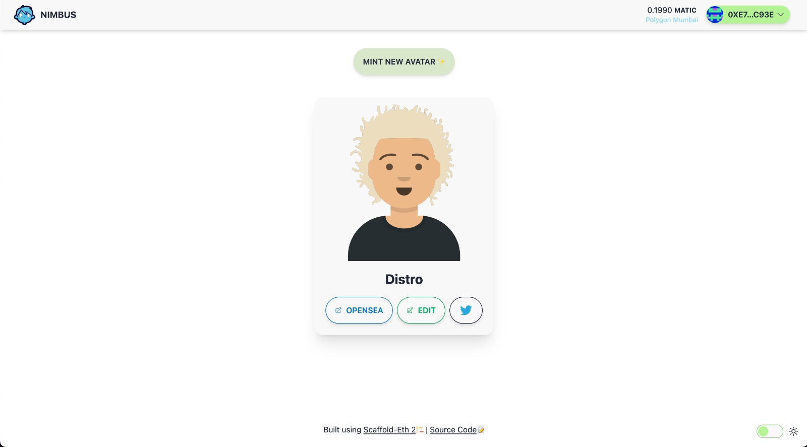

# NIMBUS

The idea behind Nimbus is to allow user to mint dynamic avatars as NFTs 👾 Which they can customise all they want (even after minting ✨) and use them as PFPs on social or anywhere else that they would use a regular NFT.

Nimbus gives you the freedom to mint an avatar just once and keep on customising it later as per your mood XD

Currently Nimbus is live on Mantle, Polygon Mumbai 🚀

It is built using [scaffold-eth 2 🏗️](https://github.com/scaffold-eth/scaffold-eth-2)

## Relevant Links

- Try it: https://nimbus-nextjs-git-v2-distroinfinity.vercel.app/
- Deployed smart contract: 
mantle - https://testnet.mantlescan.org/address/0x930a39a1370eebdf617a176d289012c2f52e7e2a

polygon - https://mumbai.polygonscan.com/address/0xcb65059572165773684ef5fe318ba301bf299583

taiko - https://explorer.test.taiko.xyz/address/0x3535E28E7f012004408aB250Fd06C4220268531B

## Images

### Desktop

---

### Original Avatar Design Credits
- React SDK for design SVGs: https://github.com/fangpenlin/avataaars
- Artist: https://twitter.com/pablostanley
